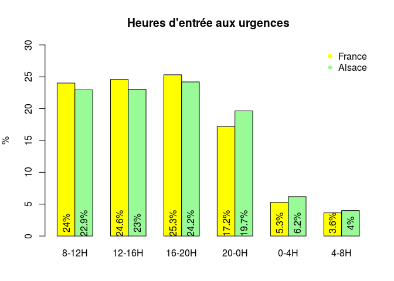
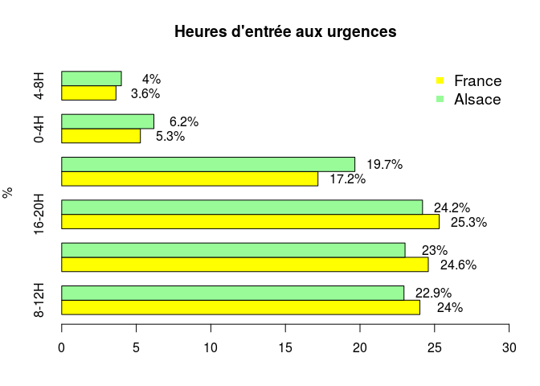

# arrive_urgences
jcb  
16 janvier 2015  

Lecture du fichier urgences-tab1-arriveeurgence. Les fichiers sont encodés au format windows, latin1, alors que R attend des fichiers en UTF-8. Il faut donc imposer avec __fileEncoding__ la forme latin1.


```r
path <- "../"
file1 <- paste0(path, "data/urgences-tab1-arriveeurgence-v5_58262602095995.csv") # toute la France
file2 <- paste0(path, "data/urgences-tab1-arriveeurgence-v5_58263739908495.csv") #  Alsace

d1 <- read.csv(file1, header = TRUE, skip = 2, fileEncoding = "latin1", blank.lines.skip = TRUE)
d1 <-d1[-1,] # supprime la ligne 1 qui est vide
d2 <- read.csv(file2, header = TRUE, skip = 2, fileEncoding = "latin1", blank.lines.skip = TRUE)
d2 <-d2[-1,]
```


Recours aux urgences

file1 <- "data/urgences-tab3-raisons-v1_71196231935810.csv"

Parcours ax urgences

file1 <- "data/urgences-base stat-anonyme-cube4-v1_71197121779560_alsace.csv"
file2 <- "data/urgences-base stat-anonyme-cube4-v1_71196680685810.csv"

Commentaires
===========
- 3/4 sont vus entre 8 et 20h
- 1/4 entre 20h et 8h

Heures d'arrivée
================


```r
par(mar = c(4,4,4,2))
ad.names <- c("8-12H", "12-16H", "16-20H", "20-0H", "0-4H", "4-8H")

ad2 <- as.numeric(as.vector(d2[1:7, 2]))
ad1 <- as.numeric(as.vector(d1[1:7, 2]))

t <- rbind(ad1,ad2) # France et alsace
t2 <- t[,-1] # on enlève la 1ere colonne = total
colnames(t2) <- ad.names
t2[1,] <-t2[1,]*100/sum(t2[1,]) # transformation en %
t2[2,] <-t2[2,]*100/sum(t2[2,])
col <- c("yellow", "pale green")
x <- barplot(t2, beside = TRUE, main = "Heures d'entrée aux urgences", ylab = "%", ylim = c(0,30), col = col)
text(x, 2, paste0(round(t2,1), "%"), , srt = 90)
legend("topright", bty = "n", legend = c("France", "Alsace"), col=col, pch = 16)
```

 

```r
# affichage horizontal
x <- barplot(t2, beside = TRUE, main = "Heures d'entrée aux urgences", ylab = "%", xlim = c(0,30), col = col, horiz = TRUE)
text(t2+2, x, paste0(round(t2,1), "%"))
legend("topright", bty = "n", legend = c("France", "Alsace"), col=col, pch = 15, cex = 1.2)
```

 
Plus de passages la nuit en Alsace mais moins en journée que la moyenne nationale

Ensemble des patients qu'ils soient venus ou non aux urgences au cours des 7 derniers jours
===========================================================================================

```r
sem2 <- as.numeric(as.vector(d2[59:64, 2]))
n <- sem2[1] - sem2[6] # nb interrogé
```

