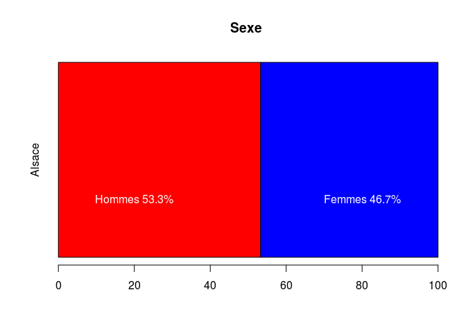
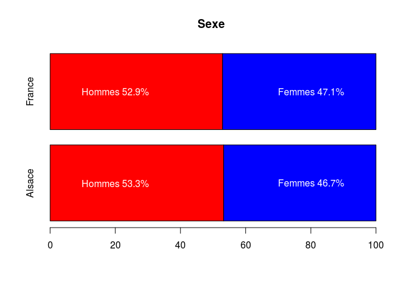
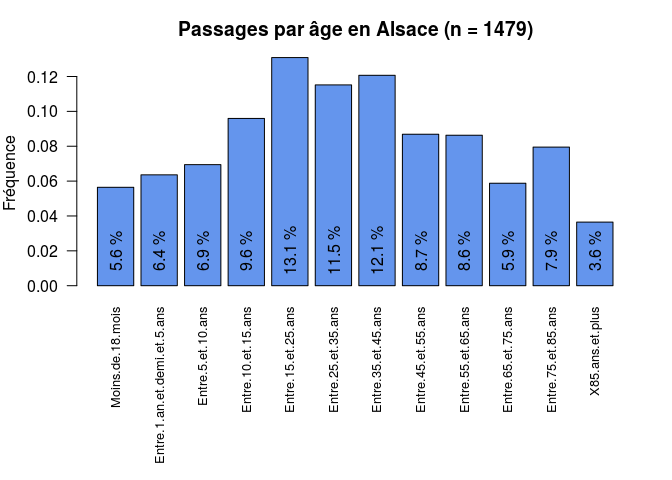
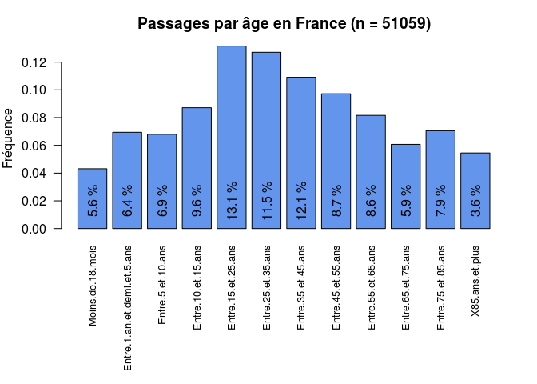
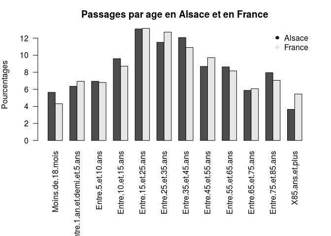
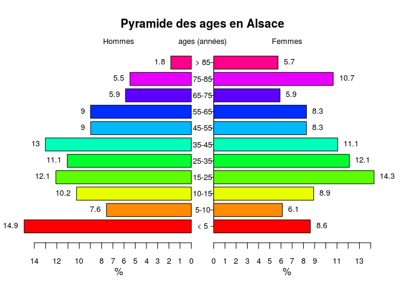
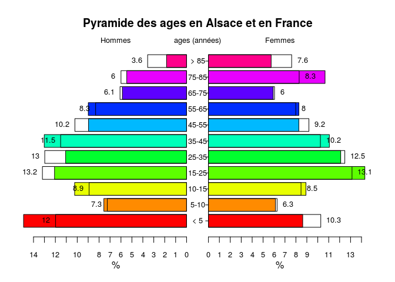

# Tableau 2 - Patientèle
jcb  
17 janvier 2015  

[Routine de dessin avec R](http://rpackages.ianhowson.com/cran/plotrix/)

Patientèle

- tranches d'age: colonne 3 à 14
- p1: toute la France
- p2: Alsace


```r
library(plotrix)

path <- "../"
file1 <- paste0(path, "data/urgences-tab2-patientele-v2_58264613345995.csv") # France
file2 <- paste0(path, "data/urgences-tab2-patientele-v2_58265115377245.csv") # Alsace

p1 <- read.csv(file1, header = TRUE, skip = 2, fileEncoding = "latin1", blank.lines.skip = TRUE)
p2 <- read.csv(file2, header = TRUE, skip = 2, fileEncoding = "latin1", blank.lines.skip = TRUE)
p2 <-p2[-1,]
p1 <-p1[-1,]
```

sexe
====


```r
n.hommes <- p2[2,2]
n.femmes <- p2[3,2]
n.ind <- p2[4,2]
n.femmes + n.hommes + n.ind
```

```
## [1] 1481
```

```r
n.sexe <- n.femmes + n.hommes
p.hommes <- n.hommes * 100 / n.sexe
p.femmes <- n.femmes * 100 / n.sexe
x <- rbind(p.hommes, p.femmes)
barplot(x, beside = FALSE, horiz = TRUE, col = c("red","blue"), main = "Sexe", names.arg = c("Alsace"))
text(20, 0.5, paste0("Hommes ", round(p.hommes,1), "%"), col = "white")
text(80, 0.5, paste0("Femmes ", round(p.femmes,1), "%"), col = "white")
```

 

```r
# france
n.hommes.f <- p1[2,2]
n.femmes.f <- p1[3,2]
n.ind.f <- p2[4,2]
tot.f <- n.femmes.f + n.hommes.f + n.ind.f
n.sexe.f <- n.femmes.f + n.hommes.f
p.hommes.f <- n.hommes.f * 100 / n.sexe.f
p.femmes.f <- n.femmes.f * 100 / n.sexe.f
x2 <- rbind(p.hommes.f, p.femmes.f)
x3 <- cbind(x, x2)
x3 <- cbind(x, x2)
colnames(x3) <- c("Alsace","France")
z <- barplot(x3, beside = FALSE, horiz = TRUE, col = c("red","blue"), main = "Sexe")
text(20, z[2], paste0("Hommes ", round(p.hommes.f,1), "%"), col = "white")
text(20, z[1], paste0("Hommes ", round(p.hommes,1), "%"), col = "white")
text(80, z[1], paste0("Femmes ", round(p.femmes,1), "%"), col = "white")
text(80, z[2], paste0("Femmes ", round(p.femmes.f,1), "%"), col = "white")
```

 
Age
===

Noter l'utilisation de __str__ pour vericaliser le texte.


```r
age <- p2[1,3:14] # age est un dataframe de 1 ligne
x <- apply(age,1, as.numeric) # on transforme en vecteur numérique
par(mar = c(10,4,3,2))
y <- barplot(t(x)/sum(x), names.arg = names(age), las = 2, cex.names = 0.8, main = paste0("Passages par âge en Alsace (n = ", round(sum(x),0),")"), ylab = "Fréquence", col = "cornflowerblue")
text(y, 0.02, paste(round(100 * t(x)/sum(x),1), "%"), srt = 90)
```

 

```r
age2 <- p1[1,3:14]
x2 <- apply(age2,1, as.numeric)
par(mar = c(10,4,3,2))
y <- barplot(t(x2)/sum(x2), names.arg = names(age2), las = 2, cex.names = 0.8, main = paste0("Passages par âge en France (n = ", round(sum(x2),0),")"), ylab = "Fréquence", col = "cornflowerblue")
text(y, 0.02, paste(round(100 * t(x)/sum(x),1), "%"), srt = 90)
```

 

```r
# comparatif
z <- rbind(t(x)/sum(x), t(x2)/sum(x2))
barplot(z*100, beside = TRUE, names.arg = names(age), las = 2, main = "Passages par age en Alsace et en France", ylab = "Pourcentages")
legend("topright", bty = "n", legend = c("Alsace","France"), col = c("gray10", "gray90"), pch = 16)
```

 

Age et sexe
===========
 

```r
# Alsace seule
age.h <- t(apply(p2[2,3:14], 1, as.numeric))
age.h <- c(sum(age.h[1:2]), age.h[3:12]) # on combine les 2 premiers éléments pour avoir une classe 0 à 5 ans

age.f <- t(apply(p2[3,3:14], 1, as.numeric))
age.f <- c(sum(age.f[1:2]), age.f[3:12])

names.age <- c("< 5", "5-10", "10-15", "15-25", "25-35", "35-45", "45-55", "55-65", "65-75", "75-85", "> 85")

pyramid.plot(age.h * 100/sum(age.h), age.f * 100/sum(age.f), labels = names.age, top.labels = c("Hommes", "ages (années)", "Femmes"), main = "Pyramide des ages en Alsace", labelcex = 0.8, show.values = TRUE)
```

 

```
## [1] 5.1 4.1 4.1 2.1
```


```r
# superpose la France et l'Alsace

pyramid.plot(age.h * 100/sum(age.h), age.f * 100/sum(age.f), labels = names.age, top.labels = c("Hommes", "ages (années)", "Femmes"), main = "Pyramide des ages en Alsace et en France", labelcex = 0.8, add = FALSE)
```

```
## [1] 5.1 4.1 4.1 2.1
```

```r
# france
age.h <- t(apply(p1[2,3:14], 1, as.numeric))
age.h <- c(sum(age.h[1:2]), age.h[3:12]) # on combine les 2 premiers éléments pour avoir une classe 0 à 5 ans
age.f <- t(apply(p1[3,3:14], 1, as.numeric))
age.f <- c(sum(age.f[1:2]), age.f[3:12])
pyramid.plot(age.h * 100/sum(age.h), age.f * 100/sum(age.f), labels = names.age, top.labels = c("Hommes", "ages (années)", "Femmes"), labelcex = 0.8, add = TRUE,  lxcol =  smoothColors("red", alpha = 0.5), rxcol = smoothColors("blue", alpha = 0.5), show.values = TRUE)
```

 

```
## [1] 4 2 4 2
```

- Patient habitant dans le même département que les urgences consultées 95.2174207 %

Assurance sociale
=================


```r
n.interroge <- p2[26,2] # nb de personnes interrogées
secu <- p2[27,2] # assuré social
ame <- p2[28, 2] # aide médicale
pas <- p2[29,2] # pas d'assurance sociale
nsp <- p2[30,2] # ne sais pas
```

Etudes
======


```r
n.interroge <- p2[40,2]
aucun.dip <- p2[41,2] # Aucun diplôme
cap <- p2[42,2] # Niveau CAP-BEP
bac <- p2[43,2] # Niveau Bac
sup <- p2[44,2] # Etudes supérieures
nsp <- p2[45,2]
```

Activité
========
    

```r
n.interroge <- p2[48,2]
actif <- p2[49,2] # Actif ayant un emploi
chomeur <- p2[50,2] # Chômeur
retraite <- p2[51,2]
etudiant <- p2[52,2]
inactif <- p2[53,2] # autre inactif
nsp <- p2[54,2]
```

Medecin traitant
================

```r
n.interroge <- p2[58,2]
med.ttt <- p2[59,2]
pas.med.ttt <- p2[60,2]
nsp <- p2[61,2]
```


